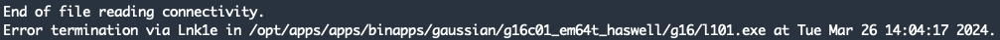
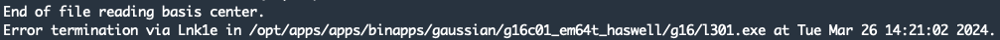

> [!IMPORTANT]  
> This advice is general and non-exhaustive. For you to be most likely to fix these errors it is necessary to view the output files with a visualisation tool, and to apply your own intuition alongside this!

# Introduction
This tutorial aims to provide more specific help for Gaussian Errors typical to our group's calculations, such as organocatalytic transition state (TS) calculations. Should you need any further help, below are some resources which provide general information on dealing with Gaussian Errors.

[Alliance Doc Wiki](https://docs.alliancecan.ca/wiki/Gaussian_error_messages)

[Blog by Zhe Wang](https://wongzit.github.io/gaussian-common-errors-and-solutions/)

Lastly, this is by no means an exhaustive list, and should you find any alternative fix/error to what is in this tutorial, please add it! Thanks.

# Index
- [Output file different to what you're expecting?](#output-file-different-to-what-youre-expecting)
- [l1](#l1)
    - [Internal consistency failure #1 in ROv08](#internal-consistency-failure-1-in-rov08)
- [l101](#l101)
    - [End of file in ZSymb](#end-of-file-in-zsymb)
    - [End of file reading Connectivity](#end-of-file-reading-connectivity)
    - [Name of the Center is Too Long](#name-of-the-center-is-too-long)
    - [RedCar failed in NewRed.](#redcar-failed-in-newred)
    - [Wanted an inter as input. Found a string as input.](#wanted-an-integer-as-input-found-a-string-as-input)
- [l301](#l301)
    - [Combination of multiplicity and electrons](#combination-of-multiplicity-and-electrons)
    - [End of File Reading Basis Center](#reading-basis-center)
    - [End of line while Reading PCM Input](#end-of-line-while-reading-pcm-input)
    - [R6DS8: Unable to choose the S8 parameter](#r6ds8-unable-to-choose-the-s8-parameter)
    - [Unrecognised Atomic Symbol](#unrecognised-atomic-symbol)
- [l502](#l502)
    - [Convergence Failure](#convergence-failure)
- [l607](#l607)
    - [Subroutine NAOANL could not find orbital](#subroutine-naoanl-could-not-find-a-_-type-orbital-on-atom)
- [l612](#l612)
    - [External program failed.](#external-program-failed-to-be-confirmed)
- [galloc: could not allocate memory](#galloc-could-not-allocate-memory)
- [Link9999](#link9999)
- [No such File or Directory](#no-such-file-or-directory)

## Output file different to what you're expecting?

**Explanation:** Sometimes the issue is not with gaussian but with the concept behind the pathway or the structure(s).

**Solution:** However these are a few things to potentially consider:

1. Consider these results. Although they may not be what you expected, it is important to remain unbiased in your study.

2. Sometimes your input is wrong, but not in a way that will generate an error. Examples include:

    - Incorrect initial geometry
    - Wrong functional or basis-set
    - Missing key words

3. If you are struggling to locate a TS it may be worthwile to check our [TS tutorial](../../tutorials/TS/README.md).

4. Don't be afraid to ask for help from people who may be familiar with your systems or your procedure/methodology

5. Lastly, sometimes what you're looking for just may not exist! Oftentimes TS are non-existent, and this is worthwhile considering, and is a result in itself!


# l1

## Internal consistency failure #1 in ROv08
<!-- l1 -->


**Explanation:** This is an error due to incorrect input of functional / basis-set

**Solution:** Ensure that you have input both a functional and a basis-set


# l101

## Coordinate type X requires x centres, not y.
<!-- l101 -->


**Explanation:** Incorrect input of modredundandant additional line(s)

**Solution:** Consider the following

1. Ensure all atomic numbering for opt=modredundant additional line is in integers and not floating point numbers.

> E.g.
> A 5 6 23 F  <---- Correct
> A 5 6 23.000 F   <---- Incorrect

2. Ensure you have included the correct number of atoms that is required for the coordinates. As detailed in the error.

3. Ensure you are using the correct type of descriptor. B for bond (2 atoms), A for angle (3 atoms) etc.

## End of file in ZSymb
<!-- l101 -->


**Explanation:** This is an input error. Gaussian is unable to locate the Z-matrix. 

**Solution:** Add a blank line to the end of your input file.

## End of file reading Connectivity
<!-- l101 -->


**Explanation:** This is an error that occurs typically when unecessarily including ```geom=connectivity```
**Solution:** Remove ```geom=connectivity```

## Name of the center is too long
<!-- l101 -->


**Explanation:** More than 3 inputs found for atomic coordinates (x,y,z)

**Solution:** Ensure that:
1. All strings denoting atoms (Eg. 'H', 'O', etc.) are present 

2. No misinputs were placed at the end of any coordinate lines.

## RedCar failed in NewRed.
<!-- l101 -->

**Explanation:** There is an issue with the Redundant coordinates (opt=ModRedundant)

**Solution:** Consider the following

1. If this occurs at the start of the optimisation; ensure you have the correct keywords at the bottom of your file, and only integers. A combination of these mistakes will result in this error, instead of the anticipated *Modredundant* error.

2. If this occurs at an optimisation step; restart the optimisation from the last step, or rotate the molecule in GaussView and resubmit.

## Wanted an integer as input. Found a string as input.
<!-- l101 -->


**Explanation:** Gaussian expected an integer but encountered a string. Typically an issue with charge / multiplicity. As these are expected integers

**Solution:** Ensure correct input for ```charge multiplicity``` & in this order.


# l301

## Combination of multiplicity and electrons is impossible
<!-- l301 -->


**Solution:** Consider the following:

1. Ensure correct input for ```charge multiplicity``` & in this order.

2. Check geometry of input file --> Ensure no bonds have been formed or made due to incorrect atom distances

## End of File Reading Basis Center
<!-- l301 -->


**Explanation:** This is an input error and relates to the use of ```gen``` as the basis set. This error can be typical when using pseudopotentials. 

**Solution:** Consider the following

1. If using ```pseudo=read```, reread over the bottom of your input file. Typical example:
```
H C S N O I 0
Basis-Set-1
****
[Blank Line]
I 0
Basis-Set-2
[Blank Line]
```

2. Remove the ```gen``` keyword and specify your basis set

## End of line while reading PCM Input.
<!-- l301 -->


**Explanation:** PCM is an acronym for Polarizable Continuum Model, a.k.a. solvent modelling. This is an error that occurs typically when using ```scrf=read```

**Solution:** Consider the following

1. Ensure solvent is correctly included at end of file

2. Remove ```scrf=read```

## R6DS8: Unable to choose the S8 parameter


**Explanation:** This error occurs when there is a mismatch in functional and dispersion. Most commonly occurs when using Minnessota functionals

**Solution:** Consider the following

1. If using Minnessota functionals (M062X etc.) you cannot use gd3bj
So instead of ```empiricaldispersion=gd3bj``` try ```empiricaldispersion=gd3```

2. Ensure your functional/basis-set and dispersion are usable together.

## Unrecognised Atomic Symbol
<!-- l301 -->


**Explanation:** This is typically an input error.

**Solution:** Consider the following

1. Reread your input file and ensure it follows this structure:

```
# Keywords
[Blank Line]
Title
[Blank Line]
Charge Multiplicity
 Element 1       X   Y   Z
 .
 .
 .
 Last Element    X   Y   Z
[Blank Line]
```

2. If using pseudopotentials, this error can typically occur with a misinput at the bottom of the file. See previous error for example.

3. Check all your atomic symbols are correctly input.

4. If using peseudopotentials this error can arise as ```Unrecognised Atomic Symbol****```. Ensure you have included ```functional/gen``` in your keywords.


# l502

## Convergence Failure
<!-- l502 -->


**Explanation:** The SCF (self-consistent field) procedure failed to converge.

**Solution:** Execute ```grep "Converged?" file.log -A5```

If 2/4 values are consistently converged, consider the following keywords

1. ```scf=xqc```

2. ```MaxStep=3``` or ```MaxStep=4```

Else:

1. Check keywords are correct

2. Poor initial geometry, therefore use an alternative initial geometry

3. Run quick preoptimisation using [xtb](https://github.com/grimme-lab/xtb)

4. If using Pseudopotential, check **all** elements are included at the bottom of the file


# l607

## Subroutine NAOANL could not find a _-type Orbital on atom
<!-- l607 -->


**Explanation:** The chosen basis-set(s) failed to include the mentioned orbital during NBO Analysis.

**Solution:** Consider the following:

1. If you are using Effective Core Potentials:
    - Ensure the mentioned atom is included at the bottom of your input file

2. Ensure your basis-set includes all atoms in your system

# l612

## External program failed. 


<!-- l612 -->


**Explanation:** (To be confirmed) You lack required permissions to access an external program.

**Solution:** (To be confirmed) Ensure you have access to the program(s) you are trying to use. A typical of this is NBO 7.0.8


# TBD

(Need examples & error codes)

## galloc: could not allocate memory

**Explanation:** This is an error relating to memory allocation. Be aware: Gaussian typically uses roughly 1GB more than specific with ```%mem```. 

**Solution:** If using CSF, ```%mem``` is not necessary so you may remove it. Otherwise consider the following

1. Increase the amount allocated using ```%mem```

2. Ensure amount is greater than 1GB

## Link9999

**Explanation:** This error most commonly occurs when an optimisation fails to converge. The output file will most likely show a repetitive back and forth when visualised. 

**Solution:** Consider the following

1. A poor intial geometry. Try an alternative starting geometry.

2. Preoptimize the structure with a worse basis set (eg. B3LYP) or semi-empirical methods (eg. [xtb](https://github.com/grimme-lab/xtb))

## No such file or directory

**Explanation:** This is likely a pathing issue regarding ```GAUSS_SCRDIR```

**Solution:** Change ```GAUSS_SCRDIR``` to your existing scratch directory.


