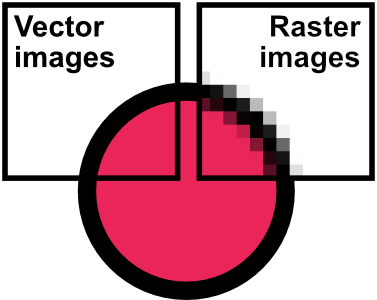
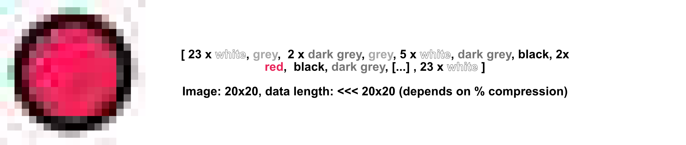
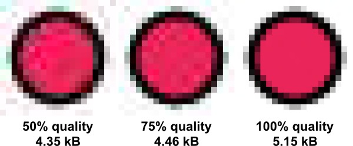
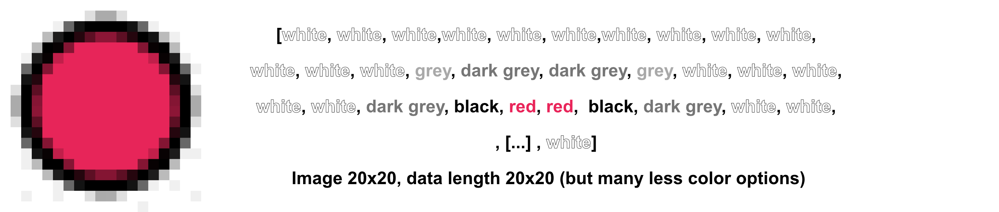
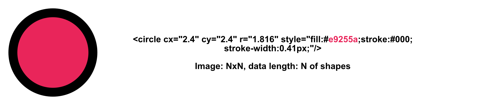

# Image Formats: A Comprehensive Guide

Images come in various formats, each tailored for specific purposes and technologies. 
Broadly, they can be categorized into two major families: **Vector Image Formats** and **Raster Image Formats**.

## Families
### 1. Vector Image Formats

Vector images are composed of paths, defined by mathematical equations. 
This allows them to be scaled infinitely without losing quality. 
They are ideal for logos, icons, and illustrations. 
**This is the kind of format that chemdraw uses, so chemical structures can be copied into graphic design programs.**

- Commonly used Vector Image formats: SVG, EPS, PDF

### 2. Raster Image Formats

Raster images are made up of pixels and ara the most common formats. 

They are resolution-dependent ans size dependent, meaning that they lose quality when you resize them.
Therefore, it is very important to save them in the exact size for their application.

Resolution is measured in DPI (dots per inch), also known as PPI (pixel per inch). 
The most common resolutions are **72dpi** for web images and **300dpi** for printing.

- Commonly used Raster Image formats: PNG, JPG, GIF, TIFF

## Commonly Used Image Formats:

- **JPEG (Joint Photographic Experts Group):**

  - **Characteristics:** Lossy compression, supports millions of colors.
  - **Uses:** Photographs, web images.
  - **Storage:** Uses lossy compression to reduce file size (BAAAD but skiiiiinny).

  
- **PNG (Portable Network Graphics):**

  - **Characteristics:** Lossless compression, supports transparency.
  - **Uses:** Web graphics, images requiring transparent backgrounds.
  - **Storage:** Uses lossless compression, maintaining image quality.
  
- **GIF (Graphics Interchange Format):**

  - **Characteristics:** Supports animations, limited to 256 colors.
  - **Uses:** Simple animations, icons.
  - **Storage:** Supports both static and animated images.
  
- **TIFF (Tagged Image File Format):**

  - **Characteristics:** Supports multiple layers, high-quality images.
  - **Uses:** Professional photography, printing industry.
  - **Storage:** Can store image data with varying color depths and pixel arrangements. It does not lose information with resizing.

  
- **PDF (Portable Document Format):**
  - **Characteristics:** Can contain text, images, and interactive elements.
  - **Uses:** Documents, forms, ebooks.
  - **Storage:** Supports both vector and raster elements.
  
- **EPS (Encapsulated PostScript):**

  - **Characteristics:** Supports vector graphics.
  - **Uses:** Print industry, vector-based illustrations.
  - **Storage:** Contains both vector and bitmap data.
  
- **SVG (Scalable Vector Graphics):**

  - **Characteristics:** Supports vector graphics and text.
  - **Uses:** Web design, vector-based illustrations.
  - **Storage:** Contains both vector and text data that can be modified, unlinke EPS.
  
Remember, the choice of format depends on the specific requirements of your project. Always consider factors like image quality, transparency, and scalability when choosing an image format.