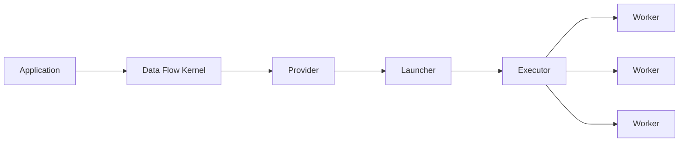

# WORKFLOWS (WIP)

To be installed and used in CSF. Currently a work in progress.

## Requirements
- [Quacc](https://quantum-accelerators.github.io/quacc/index.html) | Writes the workflow
- [Parsl](https://parsl.readthedocs.io/en/stable/) | Orchestrates the rest
<!-- - [ASE](https://wiki.fysik.dtu.dk/ase/) | Quacc Dependancy -->

## Setting up Virtual Environment

> python -m venv .venv/workflow

> source .venv/workflow/bin/activate

> pip install parsl quacc <!-- ase -->

## Quacc
### Setting Up
Put the following in a .quacc.yaml file

```
WORKFLOW_ENGINE: parsl
QUACC_ORCA6_CMD: /opt/software/RI/rhel/apps/binapps/orca/6.0.0-avx2/orca
QUACC_ORCA5_CMD: /opt/software/RI/apps/ORCA/5.0.4-gompi-2021a/orca
QUACC_GAUSSIAN_CMD: /opt/software/RI/gaussian/g16c01_em64t_detectcpu
SCRATCH_DIR: /scratch/$USER/
CREATE_UNIQUE_DIR: false
GZIP_FILES: false
```
<!-- Failsafe: 
```
QUACC_ORCA_CMD: /opt/software/RI/rhel/apps/binapps/orca/6.0.0-avx2/orca
```
-->

## Parsl
How Parsl works:


**Application** | Provides instructions for task

**Data Flow Kernel** | Brokers task execution (local system)

**Provider** | Writes requests to Slurm

**Launcher** | Defines how spread workers are across nodes

**Executor** | Execute Apps

### Setting Up


#### Config

This section is in the making.

```
from parsl.config import Config
from parsl.providers import SlurmProvider
from parsl.executors import HighThroughputExecutor
from parsl.launchers import SrunLauncher
from parsl.addresses import address_by_interface

config = Config(
    executors=[
        HighThroughputExecutor(
            label="tbd",
            address=address_by_interface('tbd'),
            max_workers_per_node=$CORES,
            provider=SlurmProvider(
                nodes_per_block=$NODES,
                init_blocks=tbd,
                partition='tbd',
                launcher=SrunLauncher(),
            ),
        )
    ],
)
```