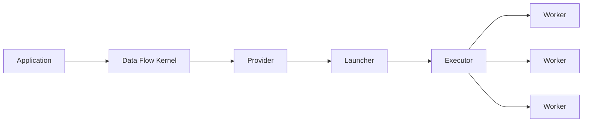
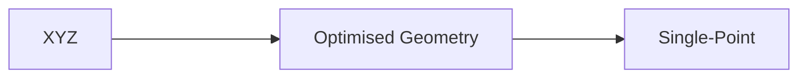
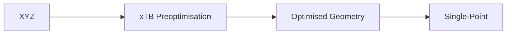
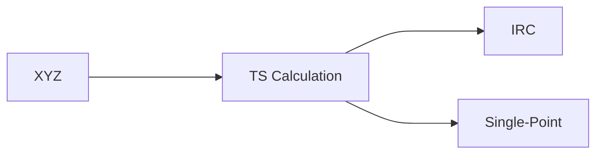

# WORKFLOWS (WIP)

To be installed and used in CSF. Currently a work in progress.

## Requirements
- [Quacc](https://quantum-accelerators.github.io/quacc/index.html) | Writes the workflow
- [Parsl](https://parsl.readthedocs.io/en/stable/) | Orchestrates the rest
- [ASE](https://wiki.fysik.dtu.dk/ase/) | Quacc Dependancy
<!--- [Covalent](https://docs.covalent.xyz/docs/os_main) | Alternative to Parsl -->


## Setting up Virtual Environment

> python -m venv .venv/workflow

> source .venv/workflow/bin/activate

> pip install git+https://github.com/tire98/quacc.git git+https://github.com/JamesOBrien2/parsl.git git+https://gitlab.com/ase/ase.git

*Requires custom made version of Parsl due to issues with SLURM Provider in Parsl.*
*Requires custom made version of Quacc due to addition of personalised Jobs*
*Requires development version of ASE due to issues with ORCA6.*

## Quacc
### Setting Up
Put the following in a .quacc.yaml file

```
WORKFLOW_ENGINE: parsl
ORCA6_CMD: /opt/software/RI/rhel/apps/binapps/orca/6.0.0-avx2/orca
GAUSSIAN_CMD: /opt/software/RI/gaussian/g16c01_em64t_detectcpu
SCRATCH_DIR: /scratch/$USER/
CREATE_UNIQUE_DIR: false
GZIP_FILES: false
```

## Parsl
How Parsl works:


**Application** | Provides instructions for task

**Data Flow Kernel** | Brokers task execution (local system)

**Provider** | Writes requests to Slurm

**Launcher** | Defines how spread workers are across nodes

**Executor** | Execute Apps

### Setting Up

#### Config

**Template**

```
from parsl.config import Config
from parsl.providers import SlurmProvider
from parsl.executors import HighThroughputExecutor
from parsl.launchers import SrunLauncher
from parsl.addresses import address_by_interface

config = Config(
    executors=[
        HighThroughputExecutor(
            label="tbd",
            address=address_by_interface('tbd'),
            provider=SlurmProvider(                     # Necessary for CSF4 (SLURM)
                nodes_per_block=$NODES,                 # Must be 1 if not Multinode Partition
                tasks_per_node=$TASKS,                  # Must be equal to numbber of cores for maximum efficiency
                init_blocks=0,                          # Advised to keep at 0
                partition='Multicore',                  # Multinode, Multicore, Serial
                launcher=SimpleLauncher(),
            ),
        )
    ],
)
```

### Workflows (g16)

**Workflow A:** (tbd)


**Workflow B:** (tbd)


**Workflow C:** (tbd)



### Workflows (ORCA6)
tbd