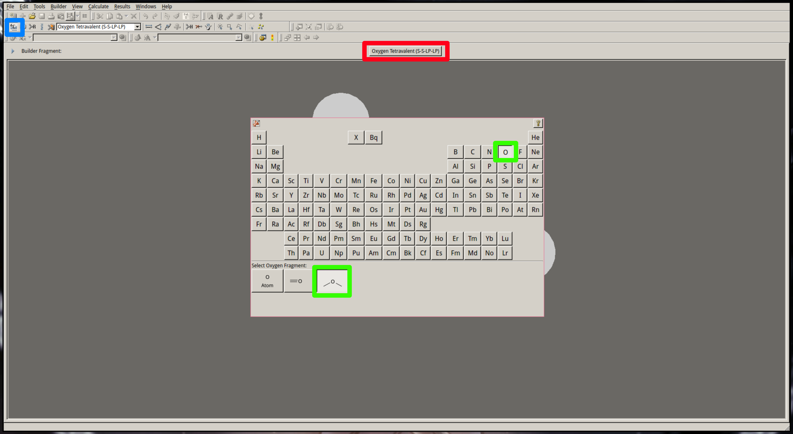
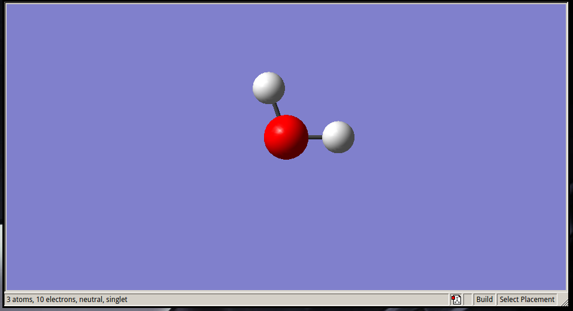
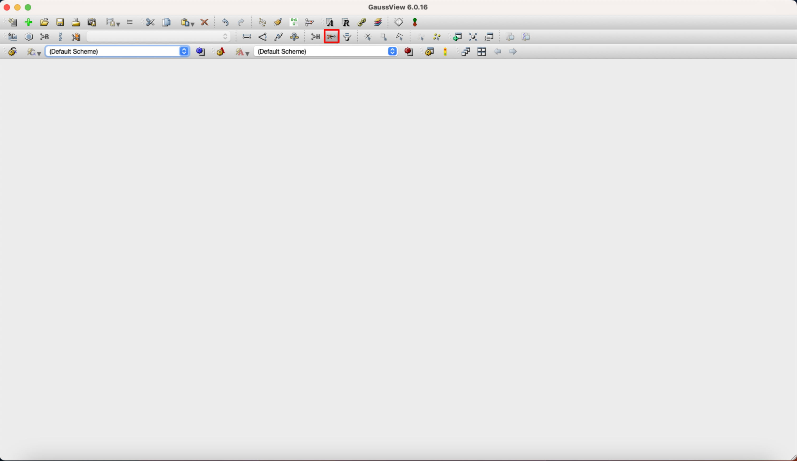
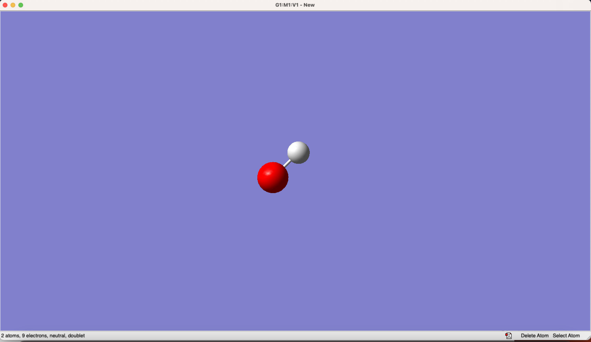

# CAT Workshop - 23rd Nov '23

# Structure
1. Theory Introduction
2. Getting Started
    - [Windows set up](../../resources/windows_users.md)
    - [SSH set up](../../resources/ssh_setup.md)
    - [Submission Script](../../scripts/submission/CSF3-4)
3. Calculations for SN2
    - GaussView
    - Submitting on CSF
4. Analysis of results
    - Energy Calculations
    - Plotting PES Diagram

# Getting Started
##### **Windows Users**
- Install WSL as detailed in [Windows set up](https://github.com/Trujillo-Group/trujillo_group_resources/tree/main/resources/windows_users.md)

##### **All Users**
- Set up your SSH as detailed in [SSH set up](https://github.com/Trujillo-Group/trujillo_group_resources/tree/main/resources/ssh_setup.md)

##### **CSF3 Users**
- Download the [submission script](https://github.com/Trujillo-Group/trujillo_group_resources/tree/main/scripts/submission/CSF3-4): *sub_g16_csf3_python* and place this in your CSF bin folder

##### **CSF4 Users**
- Download [submission script](https://github.com/Trujillo-Group/trujillo_group_resources/tree/main/scripts/submission/CSF3-4): *sub_g16_csf4_python* and place this in your CSF bin folder

# Calculations

In this tutorial we will attempt to model an SN2 reaction. In doing so we will use a software called GaussView 6 for the majority of the time. Although this is the primary interface you will be dealing with it is important to remember this is **not** the software that runs the calculations. The actual breakdown of what is used is as follows:

- [GaussView 6](https://gaussian.com/gaussview6/): Graphical Interface for Modelling
- [Gaussian 16](https://gaussian.com/g16main/): Advanced Modelling Software
- [CSF3](https://ri.itservices.manchester.ac.uk/csf3/): Computational Shared Facility provided by UoM

In short the process is:
1. ***GaussView 6*** is used to model the molecules with a Graphical User Interface (GUI). 

2. The files of these molecules are then edited to include information necessary for ***Gaussian 16*** to read.

3. The files are submitted to ***CSF*** which runs the calculations using ***Gaussian 16***.

## 1. GaussView

### Open GaussView
1. Open an interactive session on a computer node: ```qrsh -l short```
2. Load gaussian: ```module load apps/binapps/gaussian/g16c01_em64t```
3. Open GaussView 6: ```gv```

As this opens an interactive session. You will **remain** in the interactive session until you run the command ```exit``` once you have exited Gaussview.


### Using Gaussview
1. Select the *Element Fragment* tool (<span style="color:cyan">**blue**</span>)
2. Click in the *Atom Selection* tool (<span style="color:red">**red**</span>) to open the periodic table.
3. Select the *SP3* tetravalent oxygen (<span style="color:green">**green**</span>).



4. Click in the empty space in the builder window to create your first $H_2O$ molecule.
    The number of H atoms are adjusted automatically.



5. Select the *Delete Atom* tool


6. Click on one of the Hydrogens to delete it and create an OH anion


    - *Note the bottomn panel of this window:
    ```2 atoms, 9 electrons, neutral, doublet```
    GaussView won't detect ionisation. We will edit the input file later on to fix this!*

7. Save this molecule as OH_anion.gjf (File>Save>OH_anion.gjf)

*Don't forget to exit your interactive session via ```exit```.*
## 2. Prepare the input file

There are several ways of preparing and modifitying Gaussian input files. 
They can be prepared directly from GuassView, using different dedicated softwares like [AQME](https://github.com/jvalegre/aqme), your own scripts or, as you will learn here, manually using a text editor.

### General input structure

The structure of a gaussian input is very rigid and have to follow the following structure:

```
%Link 0 commands           ## Starting with %. (Optional)
# Route section            ## Starting with #. Specify the type of calculation, methodology, etc. (Mandatory)
                           ## Empty line
Title                      ## Title of the calculation
                           ## Empty line
charge multiplicity        ## Charge and multiplicity of the system
Atom X Y Z                 ## Atom type and cartesian coordinates
[...]                      ## One line for each atom
                           ## Empty line IMPORTANT, empty line at the end
```

A detailed information of each sections, the different calculation options, commands and methods available in Gaussian can be found in their [website](https://gaussian.com/input/).

## HO<sup>-</sup> input
### Keywords
Now that we have saved our input file we need top open it and change the different keywords in order to optimise the system.

For convenience, in this example we will use common computational details for the type of systems that we study in the group.
- Functional: **&omega;B97x-D**
- Karlsruhe (triple-$\zeta$ split valence polarisation with diffuse functions) basis set: **def2-tzvp**
- Continuous solvent model **SMD**.

In this example, the HO<sup>-</sup> molecule will be optimised and its vibrational frequiencies calculated to certify that the optimised structure corresponds to a minima in the Potential Energy Surface.
A continius solvent model (**SMD**) will be used to include the effect of the solvent in the calculation and **water** will be the solvent of choice.

### Modifying the file
1. **Open the input file with your text editor of choice:** 

`vi OH_anion.gjf` (if you are not familiar with `vi`, you can use any other text editor like [Sublime](https://www.sublimetext.com/3), [Atom](https://atom.en.softonic.com/) or [VScode](https://code.visualstudio.com/), or check our `vi` tutorial [here](../vi_tutorial/README.md) ).

If you saved the molecule with the default GaussView options, you should see something like:
```
    %chk=OH_anion.chk
    # hf/3-21g geom=connectivity

    Title Card Required

    0 2
    O                  0.29661015    2.18926550    0.00000000
    H                  1.25661015    2.18926550    0.00000000

    1 2 1.0
    2

```
2. **Modify the lines to match your requirements.**
Your input file should look like this after modifiying it:
```
    # opt freq wb97xd/def2tzvp scrf=(smd,solvent=water)
    
    OH Anion optimisation + frequencies
    
    -1 1
    O                  0.29661015    2.18926550    0.00000000
    H                  1.25661015    2.18926550    0.00000000

```
- Changes:
    - %chk (Checkpoint file) unnecessary
    - Keywords inputted
    - Title card named
    - Changed charge/multiplicity:
        - 0 2 (Neutral doublet) --> -1 1 (Negatively charged singlet)
    - Connectivity data removed (Last 2 lines)

3. **Save and exit the new input file**
4. **Copy the .gjf input file to .com**

`cp OH_anion.gjf OH_anion.com` 
<br></br>
The reason to use two different file extensions for the same input is that we do not overwrite any input file (.com) by mistake when we save a new one with gaussview (.gjf).

## 3. Submit the calculation

You have to run the dedicated submission script that can be found in the [submission scripts folder](https://github.com/Trujillo-Group/trujillo_group_resources/tree/main/scripts/submission).

Submission in **CSF3**:
```sub_g16_csf3_python -i OH_anion.com -c 5```
<br></br>  

Submission in **CSF4**:
```sub_g16_csf4_python -i OH_anion.com -c 5```
<br></br>
These script will generate a **run.sh** file with all the required information for the calculation and will submit it to the queue. 
Since the system is small 5 cores is enough but for bigger systems more cores will be required. For more information about the submission script refer to the scripts folder or run `sub_g16_csf3_python -h`.

3. You can check the state of the queue:

- **CSF4:** Run `squeue -u your_username` and check if it is pending (**PD**) or running (**R**).
- **CSF3:** Run `qstat -u your_username` and check if it is pending (**qw**) or running (**r**).

Once the calculation is finished, a **.log** file will be created. You can view this in GaussView.

5. All the energy data can be extrated using GaussView (right click > Results>Summary) or by running one of our designated scripts `dat.py` or `dat.src` that can be found [here](https://github.com/Trujillo-Group/trujillo_group_resources/tree/main/scripts/analysis).

**Congratulations**, you have optimised your first molecule! 
You can now try to run the remaining calculations for this SN2:
- Substrates: HO<sup>-</sup>, EtBr
- Transition State: HO<sup>-</sup> --- Et --- Br<sup>-</sup>
- Products: EtOH, Br<sup>-</sup>

Play around and do not hesitate to ask any of the group members if you have any questions.

(In case you've forgotten any names & need help: Cris, Tim, James, Maxime)
