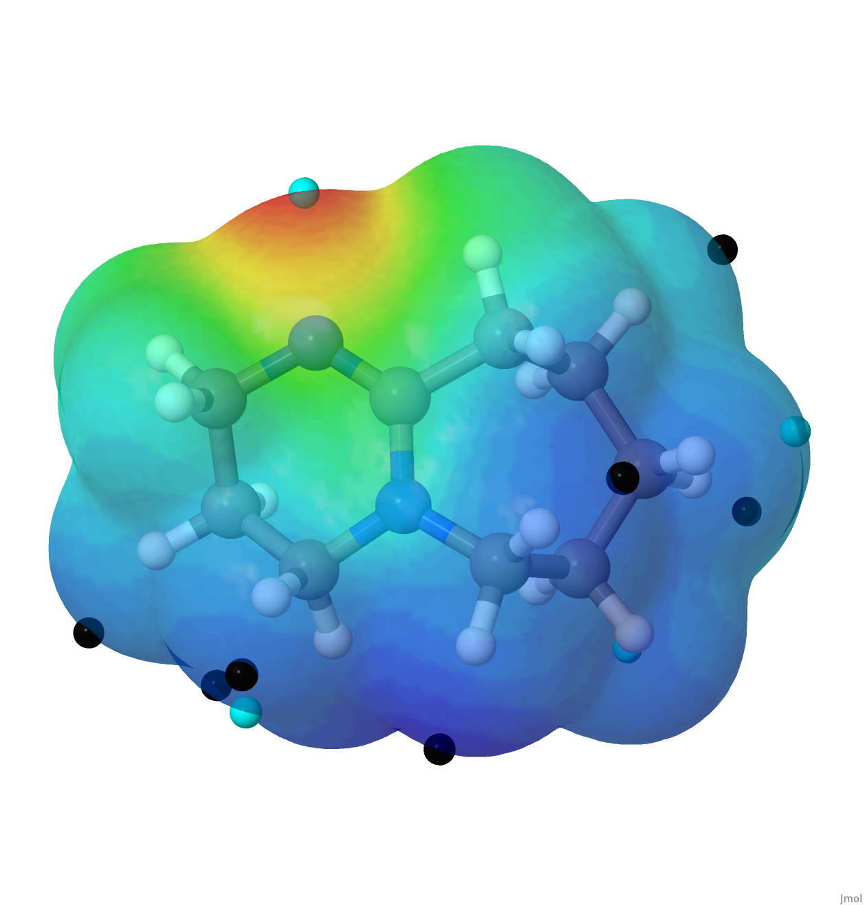
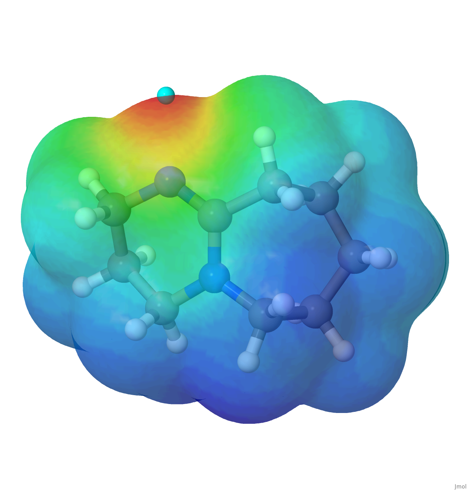
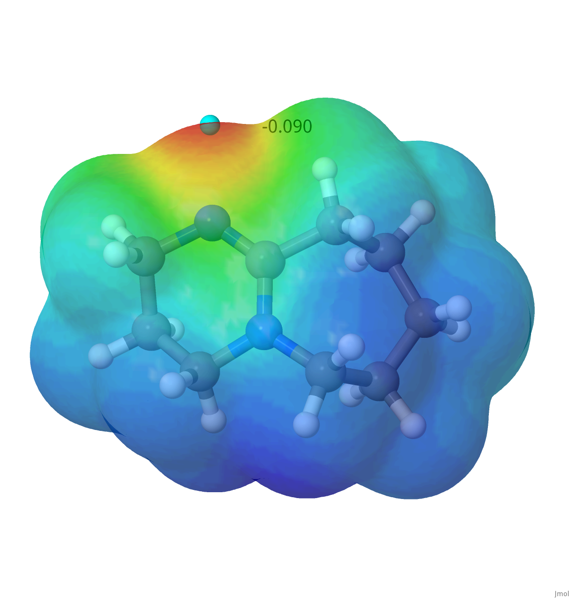

# MEP Steps

> [!IMPORTANT]  
> Due to the nature of the scripts and volume of files you will be producing, keep the `{filename}` consistent, as specified in instructions below.

1. System optimisation (or single point if already optimised) with gaussian (submission scripts available for **ICHEC** and **CSF3-4** in `scripts` folder.).
A checkpoint flag must be included in the calculation by adding `%chk={filename}.chk` at the beginning of the `.com` file.
2. If Gaussian is locally installed you can run the following steps manually in the terminal. 
If you are working in the computational center, you can find the corresponding submission script in the `scripts/submission/../sub_mep` folder and do all the following steps automatically.

    1. Format the checkpoint for making it human readible 

        ```{bash}
        formchk {filename}.chk
        ```

    2. Generate density and potential cube files

        ```{bash}
        cubegen 0 density=scf {filename}.fchk {filename}_DENS.cube 100 h
        cubegen 0 potential=scf {filename}.fchk {filename}_DENS.cube 100 h
        ```

    3. Extract critical points from the selected isosurface with MultiWFN

        ```{bash}
        Multiwfn {filename}.fchk
        ```

        The following options must me chosen for analysing the potential critical points at the default density isosurface (0.001 a.u.):

        ```
         12 Quantitative analysis of molecular surface
         0 Start analysis now
         1 Export surface extrema as plain text file
         -1 Return to upper level menu
         -1 Return to main menu
         -10 Exit
        ```

    4. Rename the surfanalysis.txt file
    
        ```{bash}
        mv surfanalysis.txt {filename}_CRIT.txt
        ```

3. Visualise the MEP using Jmol

    > [!WARNING]  
    > Due to the nature of the scripts and volume of files you will be producing, keep the `{filename}` consistent, as specified in instructions below.

    1. Make sure that your folder contains all the required files for the script to work.
        ```
        └── working directory 
            ├── {filename}_DENS.cube
            ├── {filename}_MEP.cube
            └── {filename}_CRIT.txt
        ```
    2. Generate the jmol script

        ```bash
        mep_jmol.sh {filename}
        ```

        A new file called `{filename}.jmol` will be generated containing all the information needed to visualise the MEP.
        
        The default values are:
        - Density isosurface = 0.001
        - Color range = [most_negative_minima, most_positive_maxima]
        - Isosurface material = translucent
        - Background color = white

        Two different scripts can be used for this step `mep_jmol.sh` and `men_jmol_labels.sh`.

        `mep_jmol.sh` will show the critical points as spheres (cyan for minima and black for maxima) and `mep_jmol_labels.sh` will also show a label with the value of the critical point.

        By default, all the critical points are shown in the visualisation. 
        However, you can hide as many as you want by adding '#' at the beggining of the line, commenting the corresponding lines of code in the `{filename}.jmol` file. 

        In the following example the first sphere below will be shown while the second one will be hidden:

        ```bash
        draw sphere1 diameter 0.4 {0.0 0.0 0.0} color black #MEP in a.u. 0.2184
        #draw sphere2 diameter 0.4 {1.0 1.0 0.0} color black #MEP in a.u. 0.3651
        ```

        These are some examples of different looks you can get with the options above:

        - No labels, all critical points:
        
        - No labels, 1 critical point:
        
        - 1 label, 1 critical point:
        
