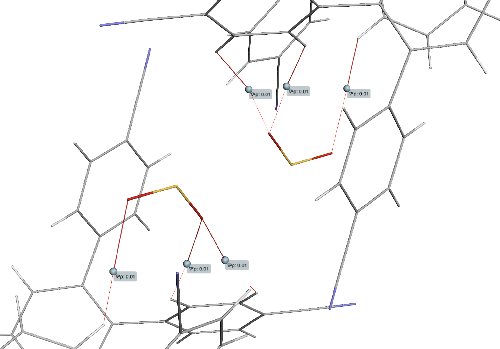
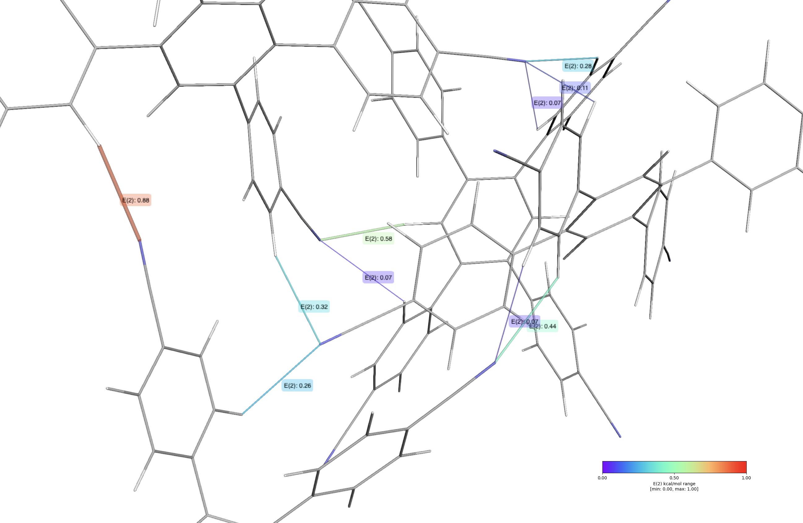
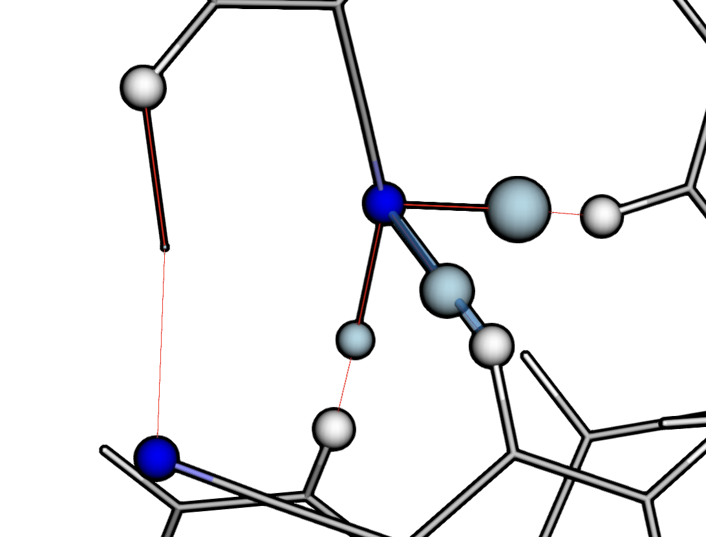
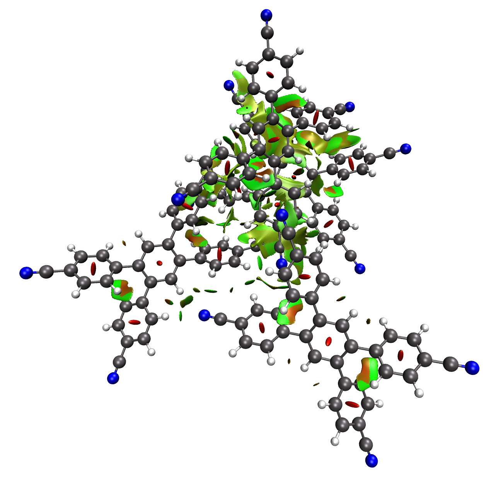
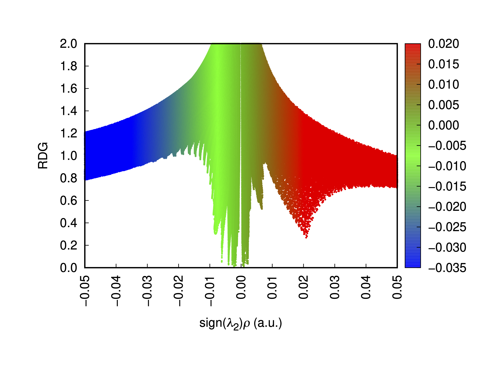

# Visualising Non-Covalent Interactions:
### From start to finish using ORCA6, NBO7, Multiwfn, VMD, and Python scripting in a Jupyter Notebook.
##### Julia Kaczmarek, 18th February 2026

There are numerous theoretical methods for identifying (and sometimes quantifying) non-covalent interactions (NCIs). Here I will briefly describe QTAIM and NBO, with steps on how to obtain visual results. I will also include a tutorial on obtaining an NCI plot. Scroll around to see examples.

---

## Quantum Theory of Atoms in Molecules (QTAIM)
This method analyses the topology of electron density distribution function in a molecule. It can be used to identify critical (that is, stationary) points (CPs) arising from the evaluation of the eigenvalues of the Hessian matrix, which is the matrix of partial second derivatives of the electron density. While certainly qualitatively useful, it has been debated whether the theory's bond paths and BCPs are suited for identifying attractive interactions, as they can arise from unphysical means and mathematical constraints (see [this article](https://link.springer.com/article/10.1007/s00894-018-3684-x) for example).

The number of different types of critical points follows a topological relation (Poincaré-Hopf relationship) for isolated molecules:

$N_{NCP} - N_{BCP} + N_{RCP} - N_{CCP} = 1$

where $N_{NCP}, N_{BCP}, N_{RCP}$ and $N_{CCP}$ represent the number of nuclear, bond, ring and cage CPs, respectively. The CPs differ by the signs of the eigenvalues of the Hessian matrix (and hence the type of stationary point). 

- NCP has all negative curvatures, i.e. is a local maxima of the electron density. It implies the presence of a nucleus, i.e. an atom. Correspond to the beginning and the end of a bond path (3,-3).

- BCP shows two positive curvatures and one negative curvature, corresponding to a saddle point of the electron density. It is the minimum density point along a bond path (3,-1).

- RCP is characterised by two positive curvatures and one negative curvature, corresponding to a different type of saddle point of the electron density (3,+1). This is usually found within a ring structure.

- CCP corresponds to local minima of the electron density and is characterised by all positive curvatures (3,+3). An example of this can be found in the centre of cubane.

For NCIs, BCPs are of interest. The values of the electron density ($\rho$) and Laplacian ($\nabla^2\rho$) at the BCPs are used to quantify and classify the nature of interactions. BCPs with $\nabla^2\rho < 0$ represent a concentration of electron density, indicating a covalent bond. For regions where $\nabla^2\rho > 0$, there is a depletion of electron density, indicating a non-covalent,  or a closed-shell, interaction.

---

## Natural Bonding Orbital (NBO) Theory
Natural Bond Orbital theory is an established way of interpreting numerical output of quantum chemistry. By obtaining the first-order reduced density matrix from the wavefunction, the NBO analysis can be used to obtain a set of orthogonal orbitals that are located in the atoms and bonds of the molecule. NBO analysis essentially provides an orbital picture of a molecule that best matches its classical Lewis structure. Non-covalent interactions can be analysed in terms of the interactions between filled and empty orbitals. NBOs do not diagonalise the Kohn-Sham operator; hence, we can interpret the off-diagonal elements between bonding orbitals or lone pairs and antibonding orbitals as the interaction between them, obtaining stabilisation energies with second-order perturbation theory. For each donor NBO (i) and acceptor NBO (j), the stabilisation energy (E(2)) associated with delocalisation is estimated as:

$E(2) = \Delta E_{ij} = q_i \frac{F(i,j)^2}{\epsilon_j - \epsilon_i}$

where $q_i$ is the donor orbital occupancy, $\epsilon_i$ and $\epsilon_j$ are diagonal elements (orbital energies) and $F(i,j)$ is the off-diagonal NBO Fock matrix element.

---

## ORCA: The Great British Wavefunction (.gbw) file
ORCA is *free for academics*. Find out more [here](https://www.faccts.de/docs/orca/6.0/tutorials/first_steps/install.html).

Though *gbw* actually stands for *Geometry-Basis-Wavefunction*, James and Tim have opened my ears to GBW being short for Great British Wavefunction, which is both amusing and, to some (me), wholly believable. 

The gbw file stores a binary summary of the **ORCA** calculation. Every calculation will produce one, whether successful or not quite – and will be needed for restarting calculations where the SCF cycle failed, for instance. For further use with the **multiwfn** software, we ideally need a good quality wavefunction, produced from a single point calculation on an optimised structure at a reasonable level of theory (depending on what you're looking at, this could be something like ωB97X-D4/Def2-TZVP).

Example input:
```ORCA
! wB97X-D4 # Functional
! def2-TZVP # Basis set

%maxcore 1000 # 1GB RAM memory per core
%pal nprocs 8 end # If you have an 8-core CPU

*xyzfile 0 1 singlet_neutral_structure.xyz
```

In its native form, the gbw file cannot be used as an input to **multiwfn** and has to be changed. **ORCA** provides functionality for this:

`orca_2mkl <gbw-file-without-.gbw-suffix> -molden`

The above will produce a *molden.input* file that can be used for **multiwfn**, though you might want to shorten it to just *.molden*:

`mv <file-name>.molden.input <file-name>.molden`

We can then move on to the QTAIM tutorial.

---

## Tutorial QTAIM (ORCA+Multiwfn+qtaim.py)
Step by step assuming a Linux/MacOS machine (Windows user try this at your own risk):

0. **Multiwfn software is free and open source**. Find out more [here](http://sobereva.com/multiwfn/). 

1. Follow the above section to obtain a `gbwfile.molden` input for Multiwfn.

2. Run using `multiwfn gwbfile.molden` 

3. Input 2 for: `2 Topology analysis`

4. `2 Search CPs from nuclear positions`

5. `3 Search CPs from midpoint of atomic pairs`

6. `4 Search CPs from triangle center of three atoms`

7. `5 Search CPs from pyramid center of four atoms`

8. `8 Generating the paths connecting (3,-3) and (3,-1) CPs` (We could also include option `9` but we are mostly interested only in the 
connections between the nuclei and BCPs)

9. `0 Print and visualize all generated CPs, paths and interbasin surfaces` Here make sure all CPs have been found - this will be apparent by the message  `Fine, Poincare-Hopf relationship is satisfied, all CPs may have been found`

10. `7 Show real space function values at specific CP or all CPs`

11. Input 0 for `0 (Note 1: If input 0, then properties of all CPs will be outputted to CPprop.txt in current folder (and if you feel the output speed is slow, you can input -1 to avoid outputting ESP, which is the most expensive one))`. This may take some time depending on how many CPs were found.

The `CPprop.txt` file and the `.xyz` file used in the ORCA calculation is what we will use for visualising the connections in a Jupyter notebook. The required Python script can be found [here](https://github.com/jak713/qtaim_vis). If you are unfamiliar with Jupyter notebooks, you can have a look at how to install the web interface [here](https://docs.jupyter.org/en/latest/install/notebook-classic.html).

12. The `qtaim.py` can be copied and pasted into a code cell in the notebook and ran. It may be missing some dependencies – run `pip install py3dmol matplotlib` to fix that.

13. Make sure both `CPprop.txt` and `<structure>.xyz` files are in the working directory. 

14. The are a few options for the `visualise` function. The full list can be found [here](https://github.com/jak713/qtaim_vis/blob/main/visualise_params.md). You may use the following template for visualising the CPs:

```Python
qtaim = QTAIM('CPprop.txt')

# Visualize using an XYZ file (same as the one used for wavefunction for multiwfn) for atomic coordinates
qtaim.visualise("<structure>.xyz",
                xyz_outline=True, # shows xyz file as stick model (useful)
                covalent=False, # if False hides (3,-3)-type CPs (nuclear)and non-positive BCPs
                show_rho=False,
                show_pos_lap=True, # generally what one might want for non-covalent interactions (positive Laplacian)
                hide_ring_cage=False, # if False hides BCPs of type (3,+3) and (3,+1)
                show_atom_labels = False, # atom type and number
                show_only_same=False, # same connecting atoms like 1C2C C -- C
                show_only_different=False, # different connecting atoms like 201N59H for N -- H
                show_bond_lengths=False,
                print_parameters=True, # print a table with all you want to know for only the displayed (as per these options) BCPs
                legend=True, # prints out a legend for the plot
                connect_atoms_A_B=True, # when wanting to study particular interactions e.g. O and H for hydrogen bonding
                A="O",
                B="H")
```

This should return something similar to this:


---

## Tutorial NBO (ORCA+NBO+nbo.py)

0. **NBO7** is not free and a license can be costly. Find out more [here](https://nbo6.chem.wisc.edu/). Orca has an NBO interface - below is an example input file that utilises this. I found that the calculation can fail due to insufficient memory, hence the inclusion of the `%nbo` input block.

```
! wB97X-D4 def2-tZVP 
! nbo 

%nbo
NBOKeyList = "$NBO MEMORY = 4gb $END"
end

%maxcore 1000
%pal nprocs 8 end

*xyzfile 0 1 singlet_neutral_structure.xyz
```

1. Obtain an output file from the **ORCA** calculation and place it in a directory along with the `<structure>.xyz` file. Start up the Jupyter notebook and acquire [this script](https://github.com/jak713/nbo_vis/blob/main/nbo.py). Either paste it in a cell and run or download it and place it either in the working directory or in your `bin/` directory.
2. Use the below template, adjusting the filenames and whatever else necessary:

```Python
test = NBO_SOP("nbo.out")

test.visualise_nbo_data("inp.xyz",
                        donor_type="LP", # Lone pair. Electron rich. Can also be BD (bonding orbital). 
                        donor="N", # Example donor 
                        acceptor_type="BD*", # Antibonding orbital - electron poor, hence can accept electron density.
                        acceptor="H", # Example acceptor 
                        E2_below=None, # Can change to a float as required
                        E2_above=None,  # Can change to a float as required
                        label=True, 
                        print_latex=False, 
                        proportional_radius=True # Make the cylinder radius of the interactions proportional to their relative strength
                        )
```

The rendered py3Dmol output should look similar to this:



---

## Combining NBO and QTAIM (combine_qtaim_nbo.py)

In the event that one would like to overlay both QTAIM and NBO results to see at a glance whether they agree with each other, [this script](https://github.com/jak713/nbo_vis/blob/main/combine_qtaim_nbo.py) can achieve this. 

Ideally, the QTAIM and NBO analyses will be done in the same Jupyter notebook, then the appropriate extra function can be imported and used directly without having to set everything else up:
```Python
from combine_qtaim_nbo import combine_qtaim_and_nbo_data

combine_qtaim_and_nbo_data(qtaim=qtaim, 
                            nbo=nbo, 
                            xyz_file="inp.xyz", 
                            donor="N", 
                            acceptor="H", 
                            label_qtaim=False, 
                            label_nbo=False, 
                            legend=False,
                            E2_above=0.1, 
                            E2_below=0.45,
                            donor_type="LP",
                            )

```

This will yield something that looks similar to this:



---

## Tutorial NCI Plotting (Multiwfn+VMD+Gnuplot)

Step by step assuming a Linux/MacOS machine (Windows user try this at your own risk (though it should mostly work)):

0. **Multiwfn software is free and open source**. Find out more [here](http://sobereva.com/multiwfn/). 

1. Follow the above section to obtain a `gbwfile.molden` input for Multiwfn.

2. Run using `multiwfn gwbfile.molden` 

3. Input 20 for: `20 Visual study of weak interaction`

4. Input 1 for: `1 NCI analysis (also known as RDG analysis)`

5. Depending on the size of your structure, you will want to select an appropriate grid. The higher the quality, the longer it will take, but also the lower the quality the more *choppy* it will be. If your structure is rather large, the `3 high quality grid` might not cut it and you will have to select option `4 Input the number of points or grid spacing in X,Y,Z, covering whole system` and input appropriate spacing, `0.2` or `0.1`, for example.

6. Once this is complete, input 2 for `2 Output scatter points to output.txt in current folder`. This will be used for the scatterplot.

7. Importantly, obtain the `cube` files by inputting 3 for `3 Output cube files to func1.cub and func2.cub in current folder`. This is for the NCI plot. 

8. Plotting the results is thankfully largely automated, we want to use **VMD**, which is *free* and can be found [here](https://www.ks.uiuc.edu/Research/vmd/). We will also need the `RDGfill.vmd` script contained within the Multiwfn examples directory, and also found [here](https://github.com/stecue/gMultiwfn/blob/master/examples/RDGfill.vmd) or an alternative version [here](https://github.com/i4hashmi/Multiwfn_3.8_dev_bin_Win64_Jul24/blob/master/examples/RDGfill2.vmd). Place both `.cub` files and the `RDGfill.vmd` and ideally start up VMD from the terminal in that directory.

9. Go to: File -> Load Visualization State... -> Select RDGfill.vmd and press okay. Your NCI plot should manifest and should look something like this:




10. For the scatterplot we use **Gnuplot**. This is free and open source and can be found [here](http://www.gnuplot.info/). On Mac, you can obtain it via [brew](https://formulae.brew.sh/formula/gnuplot).

11. For RDGscatter.gnu, find it [here](https://github.com/i4hashmi/Multiwfn_3.8_dev_bin_Win64_Jul24/blob/master/examples/scripts/RDGscatter.gnu). Place it in a directory with the `output.txt` file from Step 6.

12. Run `gnuplot RDGscatter.gnu` - this will create a postscript file that can be edited with an EPS viewer. I personally use [skim](https://skim-app.sourceforge.io/).

13. Convert the .ps file into pdf or png with the EPS viewer and you're good to go.
The resulting output should look something like this:



If you encounter any issues with any of the Python scripts in this tutorial, please let me know by raising an issue on GitHub.

Hopefully this was useful. Good luck!
