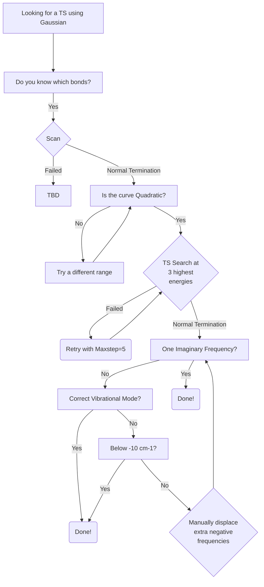

> [!IMPORTANT]  
> This tutorial is a Work-In-Progress, and is entirely from personal experience, which will differ system to system. So it must be used as advice and not trusted entirely! So feel free to add to this tutorial, as well as to question points within it.

# Introduction
This tutorial aims to provide more guidance for the **tedious** process of finding Transition States. Should you need any further help, included are some resources which provide general information on finding *pesky* Transition States (TSs).

Lastly, softwares, techniques, and methodologies are constantly improving, so should any section of this tutorial become outdated, **please** update it. If you can't, **please** at least place it in the [To-Do](../../README.md) section on the front page!

# Index
- [Gaussian](#gaussian)
- [Orca](#orca)

# Gaussian 
### Tutorials
[The DFT Course by Nathan M. Lui](https://thisisntnathan.github.io/dftCourse/LongCourse/transitionStructureSearch.html#verification)

[The 'art' of finding Transition States by Joaquin Barroso](https://joaquinbarroso.com/2016/05/26/the-art-of-finding-transition-states-part-1/)

### Workflow

### Step-by-step

1. Using GaussView or any other GUI, add all the previously optimised monomers that are involved in the TS step to a blank window.
2. Guess and create an inital input of the TS structure using your chemical intuition, for example:
    - using the correct hydrogen bond (HB) distance and angle if a HB interaction is involved
    - ensuring lone pairs of electrons are correctly oriented to be involved in a bond formation
    - ensuring that the TS bonds forming are slightly longer
    - ensuring no atoms are overlapping, too close or too far apart
    - ensuring bond angles are not at 180° as Gaussian requires linearly independent variables, which is not possible with three points on a line.
    - using known knowledge from literature about a reaction mechanism, _e.g._ in an $S_{N}2$ reaction, the nucleophile (Nu) attacks the backside - 180° from the leaving group (LG). Thus the Nu and LG atoms forming / breaking bonds overlap when looking down the reaction plane, however the overall reaction angle is not 180° due to the previous point **insert photo example of side view and front view**
4. Save the Gaussian input.
5. Put in the correct input keywords, for a simple $S_{N}2$ reaction for example:
   
Calculate vibrational frequency of your proposed TS using Freq keyword. 
Open output file with Gaussview and show the results of frequency calculation.
If number of Imaginary Frequency is greater than 1, it is not TS, because TS can have only 1 IF.
Then open Display Vibrations and choose the vibrational mode that does not relevant to your desired TS structure. You can click Start Animation to play vibration of selected mode
Click Manual Displacement and change the valuse to the lowest value by sliding the button to leftmost.
Click Save Structure. Gaussview will open the new window with an adjusted molecule from previous window.
Save it as new input and calculate frequency of new proposed TS again.
If you found guessed TS structure, which has only 1 imaginary frequency, you can use this structure for optimization of TS to search the saddle point of state.

# Orca
### Tutorials
[Vibrational Frequencies](https://www.faccts.de/docs/orca/5.0/tutorials/prop/freq.html)

[NEB-TS](https://www.faccts.de/docs/orca/5.0/tutorials/react/nebts.html)

### Workflow

