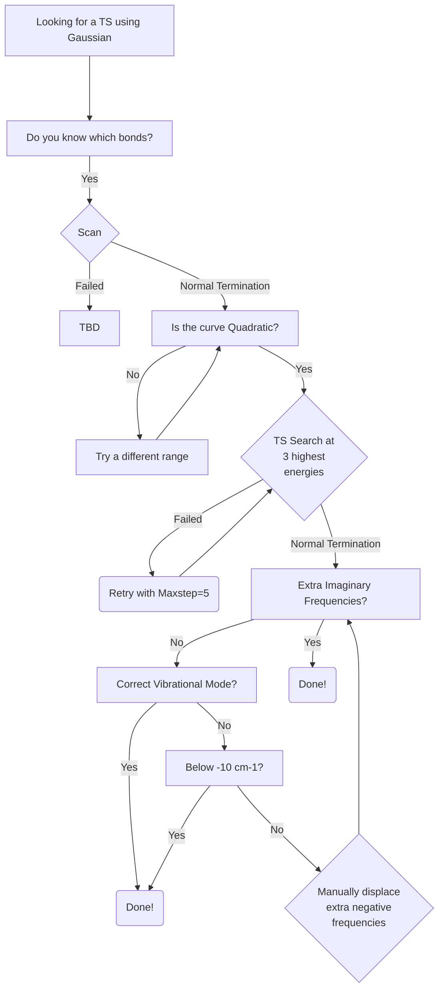

> [!IMPORTANT]  
> This tutorial is a Work-In-Progress, and is entirely from personal experience, which will differ system to system. So it must be used as advice and not trusted entirely! So feel free to add to this tutorial, as well as to question points within it.

# Introduction
This tutorial aims to provide more guidance for the **tedious** process of finding Transition States. Should you need any further help, included are some resources which provide general information on finding *pesky* Transition States.

Lastly, softwares, techniques, and methodologies are constantly improving, so should any section of this tutorial become outdated, **please** update it. If you can't, **please** at least place it in the [To-Do](../../README.md) section on the front page!

# Index
- [Gaussian](#gaussian)
- [Orca](#orca)

# Gaussian 
### Tutorials
[The art of finding transition structures](https://thisisntnathan.github.io/dftCourse/LongCourse/transitionStructureSearch.html#verification)

[The 'art' of finding Transition States](https://joaquinbarroso.com/2016/05/26/the-art-of-finding-transition-states-part-1/)

### Workflow

# Orca
### Tutorials
[Vibrational Frequencies](https://www.faccts.de/docs/orca/5.0/tutorials/prop/freq.html)

[NEB-TS](https://www.faccts.de/docs/orca/5.0/tutorials/react/nebts.html)

### Workflow

