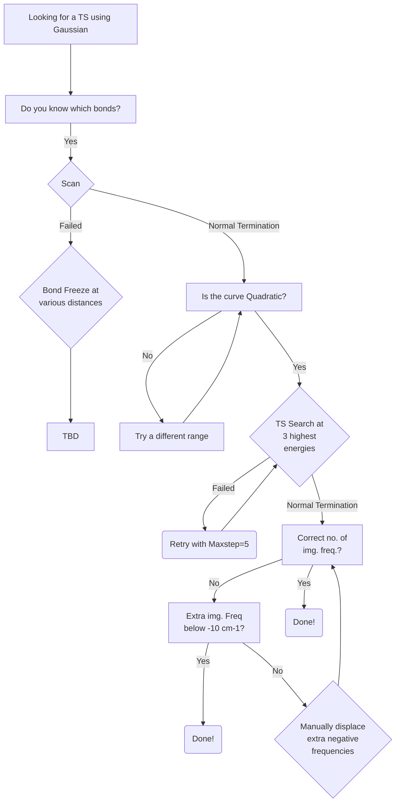
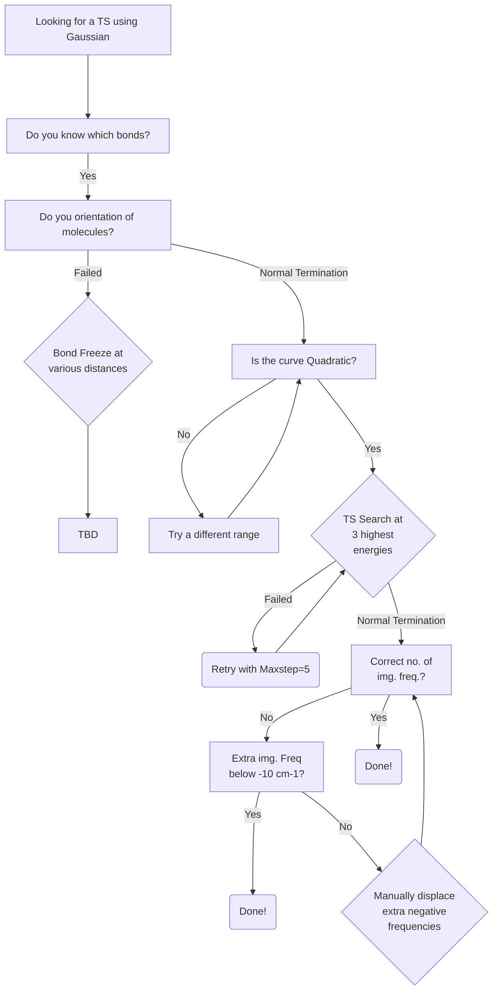

> [!IMPORTANT]  
> This tutorial is a Work-In-Progress, and is entirely from personal experience, which will differ system to system. So it must be used as advice and not trusted entirely! So feel free to add to this tutorial, as well as to question points within it.

# Introduction
This tutorial aims to provide more guidance for the **tedious** process of finding Transition States. Should you need any further help, included are some resources which provide general information on finding *pesky* Transition States (TSs).

Lastly, softwares, techniques, and methodologies are constantly improving, so should any section of this tutorial become outdated, **please** update it. If you can't, **please** at least place it in the [To-Do](../../README.md) section on the front page!

# Index
- [Gaussian](#gaussian)
- [Orca](#orca)

# Gaussian 
### Tutorials
[The DFT Course by Nathan M. Lui](https://thisisntnathan.github.io/dftCourse/LongCourse/transitionStructureSearch.html#verification)

[The 'art' of finding Transition States by Joaquin Barroso](https://joaquinbarroso.com/2016/05/26/the-art-of-finding-transition-states-part-1/)

### Workflow (when TS structure is known)




### Workflow (when TS structure is unknown)




1. Using GaussView or any other GUI, add all the previously optimised monomers that are involved in the TS step to a blank window.
2. Create an inital probable TS structure using your chemical intuition; **this is the toughest part of finding a TS!** Some tips to make life easier and ensure you are being unbiased when looking for a TS using this method are:
    - reading into the current literature-proposed mechanisms to help you understand what orientations have been studied previously
    - ensuring you are using the correct hydrogen bond (HB) distance & angle if a HB interaction is involved
    - ensuring lone pairs of electrons are correctly oriented to be involved in a bond formation
    - ensuring the TS bonds forming are slightly longer than in a reactant or product structure - $2.00 Å$ is a good starting point!
    - ensuring no atoms are overlapping, are too close or too far apart
    - ensuring bond angles are not at $180°$ as Gaussian requires linearly independent variables, which is not possible with three points on a line.

> [!Important]  
> Given only information regarding the bond being broken and formed is typically known due to our knowledge of chemical reactions using curly arrow chemistry (i.e. what atoms are involved, their approximate orientation and bond distances), the orientation of the other molecular components around this TS bond formation - breaking is a mystery! To overcome this we always 'fix' the TS bonds in space as we are certain that these 
4. Save the Gaussian input as a _.com_ file.
5. Using a Text Editor (e.g. _Vim_) input the correct keywords for a TS search into the _.com_ file:
   
```{shell}
%nprocshared=40
%mem=100GB
# opt=(calcfc,ts,modredundant,noeigentest) freq wb97xd
scrf=(smd,solvent=water) def2svp temperature=293.15

filename

0 1
 C                  0.80033600   -1.45766300    0.03102400
 C                 -0.11928200   -1.08892300   -1.15175300
 ~
 ~
 H                 -1.50600200    0.59488300   -1.59539100

B 3 28 F
B 3 15 F
```
> [!Important]  
> To understand what each new keyword means you can look them up on the offical website: [Gaussian](https://gaussian.com/keywords/). It's important to remember that calculating the vibrational frequencies using the ```freq``` keyword is critical when searching for a TS as a TS has exactly one imaginary frequency (i.e. IF = 1)
5. 
   
Calculate vibrational frequency of your proposed TS using Freq keyword. 
Open output file with Gaussview and show the results of frequency calculation.

Then open Display Vibrations and choose the vibrational mode that does not relevant to your desired TS structure. You can click Start Animation to play vibration of selected mode
Click Manual Displacement and change the valuse to the lowest value by sliding the button to leftmost.
Click Save Structure. Gaussview will open the new window with an adjusted molecule from previous window.
Save it as new input and calculate frequency of new proposed TS again.
If you found guessed TS structure, which has only 1 imaginary frequency, you can use this structure for optimization of TS to search the saddle point of state.


# Orca
### Tutorials
[Vibrational Frequencies](https://www.faccts.de/docs/orca/5.0/tutorials/prop/freq.html)

[NEB-TS](https://www.faccts.de/docs/orca/5.0/tutorials/react/nebts.html)

### Workflow


