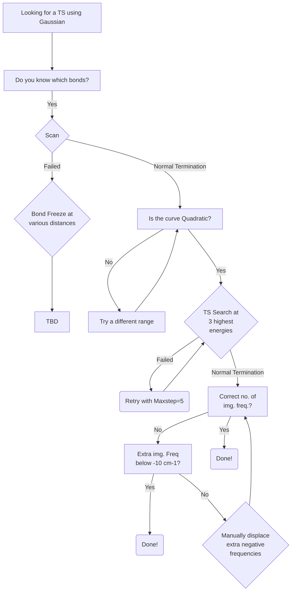
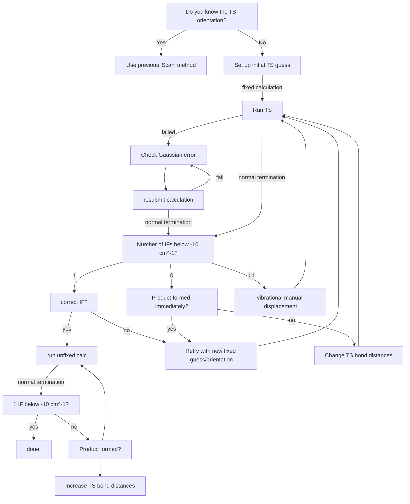

> [!IMPORTANT]  
> This tutorial is a Work-In-Progress, and is entirely from personal experience, which will differ system to system. So it must be used as advice and not trusted entirely! So feel free to add to this tutorial, as well as to question points within it.

# Introduction
This tutorial aims to provide more guidance for the **tedious** process of finding Transition States (TSs). Should you need any further help, included are some resources which provide general information on finding *pesky* TSs.

Lastly, softwares, techniques, and methodologies are constantly improving, so should any section of this tutorial become outdated, **please** update it. If you can't, **please** at least place it in the [To-Do](../../README.md) section on the front page!

# Index
- [Gaussian](#gaussian)
- [Orca](#orca)

# Gaussian 
### Tutorials
[The DFT Course by Nathan M. Lui](https://thisisntnathan.github.io/dftCourse/LongCourse/transitionStructureSearch.html#verification)

[The 'art' of finding Transition States by Joaquin Barroso](https://joaquinbarroso.com/2016/05/26/the-art-of-finding-transition-states-part-1/)

### Workflow (when TS structure is known)




### Workflow (when TS structure is unknown)

1. Using GaussView or any other GUI, add all the previously optimised monomers that are involved in the TS step to a new window.
2. Create an inital probable TS structure using your chemical intuition; **this is the toughest part of finding a TS using this method!** Some tips to make life easier and ensure you are being unbiased when looking for a TS are:
    - reading into the current literature-proposed mechanisms to help you understand what orientations have been studied previously
    - ensuring you are using the correct hydrogen bond (HB) distance & angle if a HB interaction is involved
    - ensuring lone pairs of electrons are correctly oriented to be involved in a bond formation
    - ensuring the TS bonds forming are slightly longer than in a reactant or product structure - $2.00 Å$ is a good starting point!
    - ensuring no atoms are overlapping, are too close or too far apart
    - ensuring bond angles are not at $180°$ as Gaussian requires linearly independent variables, which is not possible with three points on a line.
3. Save the Gaussian input as a _.com_ file.

> [!Important]  
> Given only information regarding the bond being broken and formed is typically known due to our knowledge of chemical reactions in 2D (i.e. what atoms are involved, their approximate orientation and bond distances), the orientation of the other molecular components around this TS bond formation - breaking is a mystery! One trick we use to overcome this is by 'fixing' the TS bonds that we know will take place using the ``` B X Y F ``` line that is inserted at the bottom of the _.com_ file; where ``` X Y ``` represent the two atoms that we want to fix in space.
> Once we obtain a fully converged structure with the correct imaginary frequency (IF), we rerun that compeleted structure with ``` B X Y B ``` instead, to 'unfix' this bond and hopefully get the true TS we need!
> Note that you can insert more than one ``` B X Y F ``` line, this is particularly useful for concerted reactions

4. Using a Text Editor (e.g. _Vim_) input the correct keywords for a TS search into the _.com_ file, a basic example being:
   
```{shell}
%nprocshared=40
%mem=100GB
# opt=(calcfc,ts,modredundant,noeigentest) freq wb97xd
scrf=(smd,solvent=water) def2svp temperature=293.15

filename

0 1
 C                  0.80033600   -1.45766300    0.03102400
 C                 -0.11928200   -1.08892300   -1.15175300
 ~
 ~
 H                 -1.50600200    0.59488300   -1.59539100

B 3 28 F
B 3 15 F

```

> [!Important]  
> To understand what each new keyword means you can look them up on the offical website: [Gaussian](https://gaussian.com/keywords/). It's important to remember that calculating the vibrational frequencies using the ```freq``` keyword is critical when searching for a TS in the potential energy surface of a reaction as a TS has exactly one imaginary frequency (i.e. IF = 1)

5. Submit the calculation to be run using the _Gaussian16_ (or _Gaussian09_) software
6. **If the calculation terminates normally**, open the output _.log_ file with GaussView
7. Check that there is only one IF that is larger than $- 10 cm^{-1}$ in the _Results_ > _Vibrations..._ tab
8. Check to make sure that this is the correct vibrational frequency that represents the bond breaking / forming vibration you are interested in
9. **If you have more than one IF**, select one of those modes that does not correspond to the one you need
10. Click _Start Animation_ to play the vibration of the selected mode and see what sort of motion this involves
11. Click _Manual Displacement_ and change the value to either "1" or "-1" and press _Save Structure..._
12. This will open the new structure in a new window
13. Save this as new input and add all the previous keywords used
14. Rerun this new structure until the calcaultion completes with only one IF being returned.
15. **If the calculation failed**, check the error listed at the end of the _.log_ file and resubmit the calculation once you determine what will solve this error.

> [!Important]  
> The most common errors in the TS search are listed in the [Gaussian Errors](https://github.com/Trujillo-Group/trujillo_group_resources/tree/main/resources/gaussian_errors) section.

16. **If the calculation terminates normally, however this has no IFs**; a product is most likely formed.
17. If this is the case, check the _Results > Optimisation..._ tab to see what happened during the run.
18. **If the calculation terminates normally, and the TS is the one you are looking for**; congrats! you have found your first TS structure!





# Orca
### Tutorials
[Vibrational Frequencies](https://www.faccts.de/docs/orca/5.0/tutorials/prop/freq.html)

[NEB-TS](https://www.faccts.de/docs/orca/5.0/tutorials/react/nebts.html)

### Workflow


