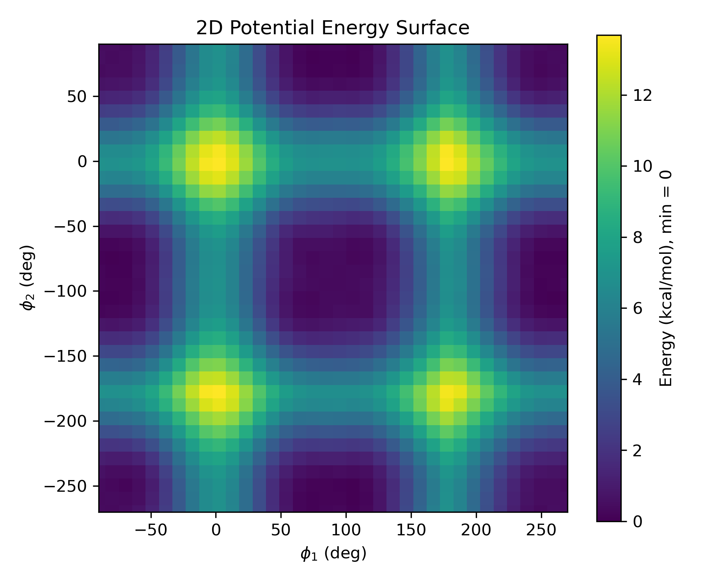

# Setting up the scan

A Moore O'Ferrall Jencks plot requires the complete scan of two variables, resulting in N^2 scaling. In doing so, a 2D plot can be obtained. An exmaple of where this can be beneficial is in catalysis, where for a bidentate catalyst, you may want to scan the rotational energy barrier of both catalytic arms, to identify the total energetic profile of the system for conversion between cis / trans configurations. (Insert example figure below)

# Calculating the 2D scan

Due to the N^2 scaling of scans over two variables, it is typical and recommended to use either semi-empirical or ML-based methods for these scans. As such, you can anticipate lower than DFT-based energy accuracies, however this will ensure the ability to completely map out the 2D scan. Furthermore, although smaller step sizes will provide a higher resolution scan, due to the additional dimensionality of the scan, computational time increases significantly more than one may be used to.

## Example: Rotational barriers from Cis/Trans orientations of the arms in an organocatalytic system.

```
! xTB ALPB(Water) Opt
%geom
  scan D 1 2 3 4 = 0, 360, 18 end
  scan D 5 6 7 8 = 0, 360, 18 end
end
* xyzfile 0 1 inp.xyz
```

# Visualising the 2D scan

Once the 2D scan has been completed, you will have a series of energy values corresponding to each combination of the two scanned variables. To visualise this data, you can use Python with libraries such as NumPy and Matplotlib to create a contour plot or surface plot. I've provided a !(link)[https://github.com/JamesOBrien2/my_scripts/blob/main/plots/plot2d.py] to a python script that can be used to generate these plots below:


