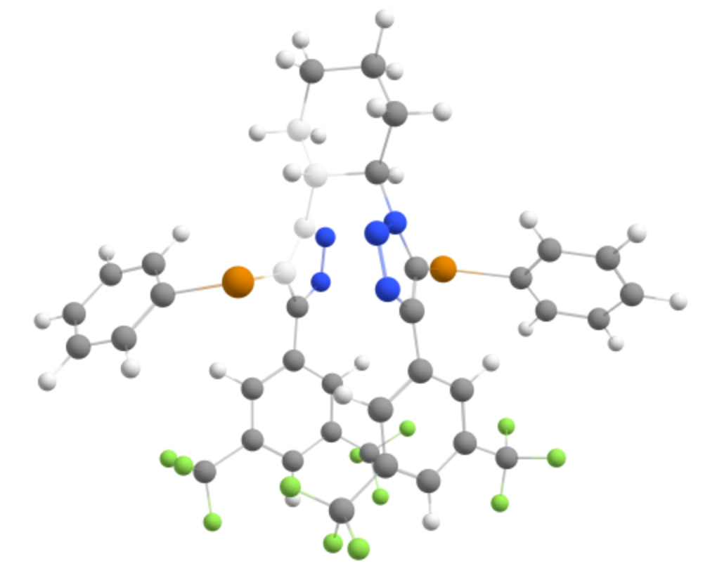
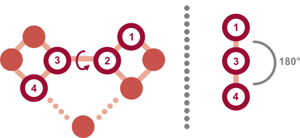

# Finding the correct dihedral angle

The first step in calculating rotational barriers is to identify the dihedral angle of interest. This can typically be done using molecular visualization software to inspect the 3D structure of the molecule and select the four atoms that define the dihedral angle. It is important to ensure that the selected atoms accurately represent the rotational axis you wish to study. For example, to identify the rotational barrier for a catalyst arm to convert from monodentate to bidentate binding mode, you would select the atoms involved in the bond rotation that facilitates this change, as shown below:




# Setting up the scan

Once the atoms involved in the dihedral angle have been identified, the next step is to set up a dihedral scan. This involves defining a series of dihedral angles to sample, typically ranging from 0° to 360° in increments (e.g., every 1-10°). The choice of increment size can affect the resolution of the resulting energy profile; smaller increments provide more detail but require more computational resources.

As such, it is recommended to start with small increments (e.g., 1°) with a method that has a low computational cost (xTB). This can be further refined using energies from DFT calculations at the optimized geometries from the initial scan.



# Performing the scan (ORCA 6.1)

To perform the dihedral scan using ORCA 6.1, you will need to create an input file that specifies the dihedral scan parameters. Below is an example of how to set up the input file for a dihedral scan:

```plaintext
! XTB ALPB(Water) Opt
%geom
    Scan D 1 2 3 4  = starting_angle, end_angle, number_of_steps end# Replace 1,2,3,4 with the atom indices of the dihedral
end
* xyzfile 0 1 inp.xyz
```
