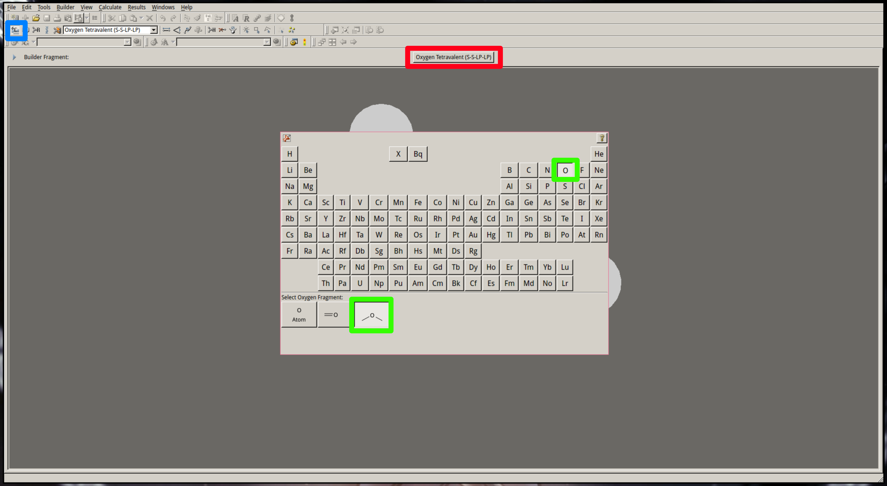
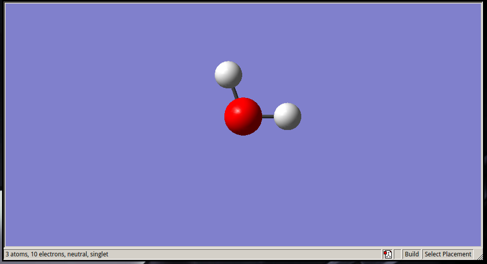

# Step by step gaussian submission

This tutorial will help you to submit your first quantum optimisation using Gaussian.
We will use Gaussview to build our system, but you can use other tools like [Avogadro](https://avogadro.cc/) or the new version of [VMD](https://pubs.acs.org/doi/10.1021/acs.jcim.3c00658).

The computaitonal chemistry equivalent to the `hello world!` script is the optimisation of a water molecule ($H_2O$), so that is what we will use here as well.

## Outline
 - [Requirements](#requirements)
 - Steps
    1. [Build the system](#1.-build-the-system)
    2. [Prepare the input file](#2.-prepare-the-input-file)
    3. [Modify the lines to match your requirements](#3.-modify-the-lines-to-metch-your-requirements)
    4. [Submit the calculation](#4.-submit-the-calculation)
## Requirements
- GaussView (available in CSF3)
- Gaussian (available in ICHEC and CSF3/4)
- [Submission script](https://github.com/Trujillo-Group/trujillo_group_resources/tree/main/scripts/submission) 

## 1. Build the system

Open GaussView and follow the steps: 
1. Select the *Element Fragment* tool selected (<span style="color:cyan">**blue**</span>)
1. Click in the *Atom Selection* tool (<span style="color:red">**red**</span>) to open the periodic table.
1. Select the *SP3* tetravalent oxygen (<span style="color:green">**green**</span>).



4. Click in the empty space in the builder window to create your first $H_2O$ molecule.
    The number of H atoms are adjusted automatically.



5. Save your first molecule as h2o.gjf (File>Save>water.gjf).

## 2. Prepare the input file

There are several ways of preparing and modifitying Gaussian input files. 
They can be prepared directly from GuassView, using different dedicated softwares like [AQME](https://github.com/jvalegre/aqme), your own scripts or, as you will learn here, manually using a text editor.

### General input structure

The structure of a gaussian input is very rigid and have to follow the following structure:

```
%Link 0 commands           ## Starting with %. (Optional)
# Route section            ## Starting with #. Specify the type of calculation, methodology, etc. (Mandatory)
                           ## Empty line
Title                      ## Title of the calculation
                           ## Empty line
charge multiplicity        ## Charge and multiplicity of the system
Atom X Y Z                 ## Atom type and cartesian coordinates
[...]                      ## One line for each atom
                           ## Empty line IMPORTANT, empty line at the end
```

A detailed information of each sections, the different calculation options, commands and methods available in Gaussian can be found in their [website](https://gaussian.com/input/).

## $H_2O$ input

Now that we have saved our input file we need top open it and change the different keywords in order to optimise the system.

For convenience, in this example we will use common computational details for the type of systems that we study in the group.
- Functional: **$\omega$B97x-D**
- Karlsruhe (triple-$\zeta$ split valence polarisation with diffuse functions) basis set: **def2-tzvp**
- Continuous solvent model **SMD**.

In this example, the $H_2O$ molecule will be optimised and its vibrational frequiencies calculated to certify that the optimised structure corresponds to a minima in the Potential Energy Surface.
A continius solvent model (**SMD**) will be used to include the effect of the solvent in the calculation and **water** will be the solvent of choice.

In order to modify the input file you have to:
1. **Open the input file with your text editor of choice:** 

`vi h2o.gjf` (if you are not familiar with `vi`, you can use any other text editor like [Sublime](https://www.sublimetext.com/3), [Atom](https://atom.en.softonic.com/) or [VScode](https://code.visualstudio.com/), or check our `vi` tutorial [here](../vi_tutorial/README.md) ).

    If you saved the molecule with the default GaussView options, you should see something like:
    ```
    %chk=h2o.chk
    # hf/3-21g geom=connectivity
    
    Title Card Required
    
    0 1
     O                  0.74766353   -0.51401868    0.00000000
     H                  1.70766353   -0.51401868    0.00000000
     H                  0.42720895    0.39091715    0.00000000
    
     1 2 1.0 3 1.0
     2
     3
    ```

2. **Modify the lines to match your requirements.**
   
 - **ICHEC**:

    Your input file should look like this after modifiying it:
    ```
    %nprocshared=40
    %mem=50GB
    %chk=h2o.chk
    # opt freq wb97xd def2tzvp scrf=(smd,solvent=water)
    
    Water optimisation + frequencies
    
    0 1
     O                  0.74766353   -0.51401868    0.00000000
     H                  1.70766353   -0.51401868    0.00000000
     H                  0.42720895    0.39091715    0.00000000

    ```
    If you are working in **ICHEC**, 40 is the maximum number of shared process/cores that can be used and 100GB is the maximum memory that can be allocated for a calculation.

 - **CSF3 / CSF4:**

    Your input file should look like this after modifiying it:
    ```
    %chk=h2o.chk
    # opt freq wb97xd def2tzvp scrf=(smd,solvent=water)
    
    Water optimisation + frequencies
    
    0 1
     O                  0.74766353   -0.51401868    0.00000000
     H                  1.70766353   -0.51401868    0.00000000
     H                  0.42720895    0.39091715    0.00000000

    ```

    If you are working in **CSF3**: 32 is the maximum number of cores that can be used for a calculation.
    
    If you are working in **CSF4**: 40 is the maximum number of cores that can be used for a calculation.

3. **Save and exit the new input file**
4. **Copy the .gjf input file to .com**

 `cp h2o.gjf h2o.com` The reason to use two different file extensions for the same input is that we do not overwrite any input file (.com) by mistake when we save a new one with gaussview (.gjf).

## 3. Submit the calculation

Once the input file is created and the keywords modified, the next step would be transfering it to the desired computational center and submitting the calculation to the queue.

1. Transfer the file to the computational center. If you are using a visual FTP server, like MobaXterm in windows, you can drag and drop the file to the desired folder. If you are using the terminal, **as you should**, the dedicated command for copying files *via* ssh is **scp**:

   - ICHEC : ```scp -i "~/.ssh/your_private_ssh_key" h2o.com username@domain.com:/path/to/your/folder/```
   
   - CSF3 / CSF4 :    ```rsync -avz h2o.com username@csf3.itservices.manchester.ac.uk:/path/to/your/folder```

2. Once connected to the computational center

    ```ssh -i "~/.ssh/your_private_ssh_key" username@domain.com```

    You have to run the dedicated submission script that can be found in the [submission scripts folder](https://github.com/Trujillo-Group/trujillo_group_resources/tree/main/scripts/submission).
    
    - Submission in **ICHEC** using `sub_gaussian`:

        ```sub_gaussian -i h2o.com -p project_code -t 1:00 -q DevQ```

        This command will generate a **.job** file with all the required information for the run and will submit it to the queue. 
        Since the system is small 1:00 is enough but for bigger systems longer times and different queues will be required. For more information about the submission script refer to the scripts folder or run `sub_gaussian -h`.
<br><br>

    - Submission in **CSF3** using `sub_g16_csf3_python`:

        ```sub_g16_csf3_python -i h2o.com -c 5```
  
    - Submission in **CSF4** using `sub_g16_csf4_python`:

        ```sub_g16_csf4_python -i h2o.com -c 5```

        These command will generate a **run.sh** file with all the required information for the run and will submit it to the queue. 
        Since the system is small 5 cores is enough but for bigger systems more nodes will be required. For more information about the submission script refer to the scripts folder or run `sub_g16_csf3_python -h`.

  

3. You can check the state of the queue:
   - **ICHEC / CSF4:** Run `squeue -u your_username` and check if it is pending (**PD**) or running (**R**).
   - **CSF3:** Run `qstat -u your_username` and check if it is pending (**qw**) or running (**r**).

4. Once the calculation is finished, a **.log** file will be created. You can download this file to your local computer and open it with GaussView by running the following commmand in your local computer (not in the computational center).

   - **ICHEC:**    ```scp -i "~/.ssh/your_private_ssh_key" username@domain.com:/path/to/your/folder/h2o.log ./```


   - **CSF3 / CSF4:**    ```rsync -avz username@csf3.itservices.manchester.ac.uk:/path/to/your/folder/h2o.log .```


5. All the energy data can be extrated using GaussView (right click > Results>Summary) or by running one of our designated scripts `dat.py` or `dat.src` that can be found [here](https://github.com/Trujillo-Group/trujillo_group_resources/tree/main/scripts/analysis).

**Congratulations**, you have optimised your first molecule! 
You can now try to run more complex systems like a benzene ring, an amino acid, ionic compounds or bigger molecules like caffeine.
Or you can try model a full reaction path through the available SN2_tutorial!

Play around and do not hesitate to ask any of the group members if you have any questions.

For reference:

 - Users familiar with ICHEC: Cris, Inigo, Nika, Diana
  
 - Users familiar with CSF3/4: Cris, Tim, James
